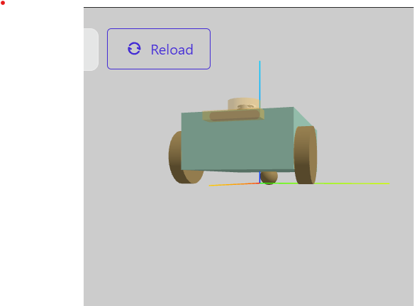

Two-Wheel Differential Drive Robot

Project Overview

This project contains a URDF/Xacro description of a simple two-wheel differential drive robot.

The robot is designed with:

- One "base_link" as the main body of the robot.
- Two driving wheels: left and right.
- One rear caster wheel for support and balance.
- The two driving wheels are created using a reusable Xacro macro.
- The caster wheel is defined separately because it is a single component with a different function.

The robot can be visualized using the URDF Visualizer to check the robot structure, wheel placement, caster position, LiDAR and camera position.

Robot Structure

The main robot structure is:

                  base_link
                 /     |     \
                
      left_wheel  right_wheel  caster_wheel
                              

Base Link

"base_link" represents the main body of the robot.

Base footprint

"base_footprint" represents the reference point located at the ground level of the robot.

Driving Wheels

The robot has two mobile driving wheels (type:continuous):

- "front_left" — left driving wheel
- "front_right" — right driving wheel

Both driving wheels use the same Xacro "wheel" macro because they are repeated components with the same geometry and structure.

Caster Wheel

The caster wheel is a small spherical support underneath the rear of the robot.

Unlike the driving wheels, the caster is defined separately because it is only used once and does not require the same Xacro macro.

The caster is connected to "base_link" using a fixed joint:

                        base_footprint
                            | 
                            |
                        base_link
                       /     |       \
                      /  fixed-joint  \
                     /       ↓         \
         left_wheel       caster_wheel   right_wheel
          |                  |                     | 
  cylinder geometry          | sphere geometry     cylinder geometry

The caster provides support and balance for the robot, no motion modeled for this caster wheel.

Folder Structure

The project is organized as follows:

robot_description_norasheikhly/
│
├── src/
│ └── robot_description/
│      ├── urdf/
│      │     └── robot.urdf.xacro
│      │ 
│      │
│      ├── meshes/
│      │    └── lidar.STL
│      │    └── zed.stl
│      ├── package.xml
│      └── CMakeLists.txt
│
├── README.md/images
│ ├── robot preview 1.png
│ └── robot preview 2.png
│
└── README.md

Xacro Structure

The reusable components used:
The driving wheels are defined using a reusable Xacro macro. This avoids repeating the same wheel definition twice.

The two wheels are created as:

<xacro:wheel prefix="front_left" x_reflect="1" y_reflect="1"/>

<xacro:wheel prefix="front_right" x_reflect="1" y_reflect="-1"/>

The fixed component not under Xacro:
The caster wheel is defined separately as a sphere and connected to "base_link" using a fixed joint.

The xacro file structure:
1. define the elements: xml version, robot attribute-name and xmls:xacro to use xacro properties and macro
2. define mesh to be able to use mesh files
3. Properties: Base and Wheel
4. Add base link 
                |___ Visual: Box size and color blue 
                |___ Collision
                |___ inertia
5. Add base footprint 15cm away from base link
6. Add Wheel link:
                |___ Visual: cylinder (radius, ength) and color black
                |___ Collision
                |___ inertia
   Caster wheel link (not under xacro file)               
                |___ Visual: sphere (radius) and color black
                |___ Collision
                |___ inertia
7. Wheel joint: continuous (under xacro/macro)          
                |___ parent: base link
                |___ child: wheel link
                |___ origin 
                |___ axis
8. Caster Joint: fixed (not under xacro/macro)          
                |___ parent: base link
                |___ child: caster wheel
                |___ origin 
                |___ axis
9. Call Xacro dunction of the 2 wheels
10. Add LiDAR Link (mesh file)
11. Add camera Link (mesh file)

Building the robot:
Creat and Navigate to the workspace:
robot_description-norasheikhly (cd ~/workspaces
mkdir -p robot_description-norasheikhly/src)
   |___src
     |___robot_description pkg (ros2 pkg create --build-type ament cmake robot_description)
       |__ urdf (mkdir)
       | |__ robot_description.urdf.xacro (touch) fill code (nano)
       |
       |__ meshes (mkdir) 
       | |__ camera.stl (drag & drop)
       | |__ lidar.STL (drag & drop)
       |
       |__CMakeLists.txt (Modify from VS to copy the mesh files to the package and be seen and loaded) and (update robot.urdf.xacro with new data of the meshes)

Build the package:
colcon build
After building, source the workspace:
source install/setup.bash

Previewing the Robot
The robot can be previewed using the URDF Visualizer.

The visualizer can be used to verify:
- The robot body.
- The left driving wheel.
- The right driving wheel.
- The rear caster wheel.
- The position and alignment of the wheels.
- The caster touching the same ground level as the driving wheels.

Robot Preview

The following image shows the complete robot in the URDF Visualizer (side view).

An additional front view of the robot with collision

Assignment Requirements
This project includes:
- A "base_link".
- Two mobile/driving wheels.
- A caster wheel in addition to the two mobile wheels.
- Reusable Xacro macro for the repeated driving wheels.
- A separately defined spherical caster.
- A fixed joint connecting the caster to "base_link".
- LiDAR sensor placed on the top middle front of the robot
- Camera sensor placed in the front side of the chasis.
- A README explaining the project and robot structure.
- Instructions for building and previewing the robot.
- Screenshots of the robot visualization.

