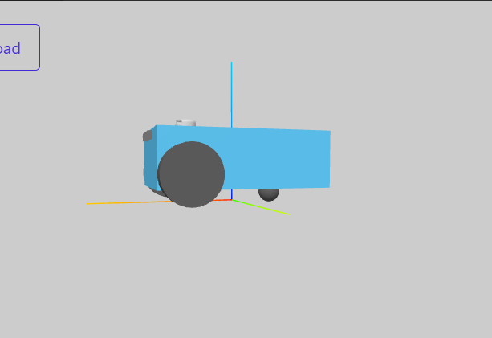
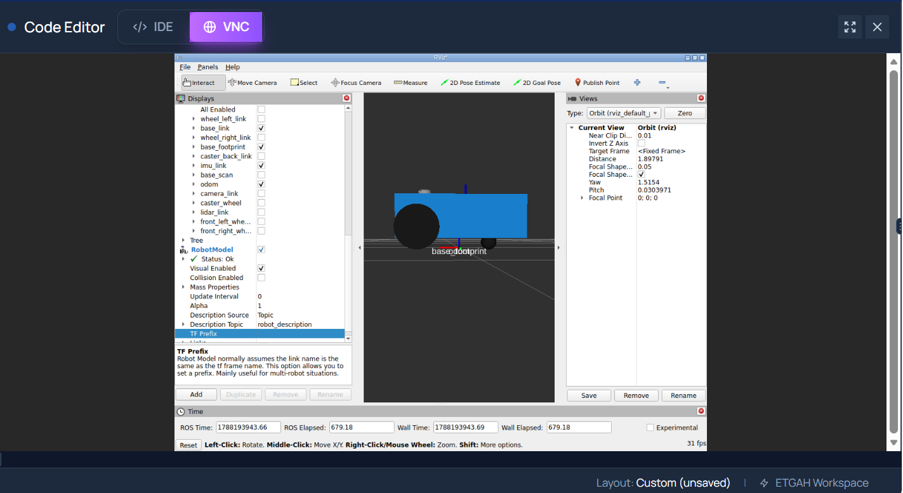

Two-Wheel Differential Drive Robot 

Project Overview

This project contains a URDF/Xacro description and gazebo of a simple two-wheel differential drive, one passive caster wheel (with less friction) a LiDAR sensor, and camera. The project supports visualization (RViz), TF generation, simulation and navigation.

The robot is designed with:

- One "base_link" as the main body of the robot.
- Two driving wheels: left and right.
- One rear caster wheel for support and balance.
- The two driving wheels are created using a reusable Xacro macro.
- The caster wheel is defined separately because it is a single component with a different function.
- LiDAR Sensor
- Camera 

The robot can be visualized using the URDF Visualizer to check the robot structure, wheel placement, caster position, LiDAR and camera position. addons with RViz visualization and Gazebo simulation.

Robot Structure

The main robot structure- URDF is:

                  base_link
                 /     |     \
                
      left_wheel  right_wheel  caster_wheel
                              

Base Link

"base_link" represents the main body of the robot.

Base footprint

"base_footprint" represents the reference point located at the ground level of the robot.

Driving Wheels

The robot has two mobile driving wheels (type:continuous):

- "front_left" — left driving wheel
- "front_right" — right driving wheel

Both driving wheels use the same Xacro "wheel" macro because they are repeated components with the same geometry and structure.

Caster Wheel

The caster wheel is a small spherical support underneath the rear of the robot.

Unlike the driving wheels, the caster is defined separately because it is only used once and does not require the same Xacro macro.

The caster is connected to "base_link" using a fixed joint:

                        base_footprint
                            | 
                            |
                        base_link
                       /     |       \
                      /  fixed-joint  \
                     /       ↓         \
         left_wheel       caster_wheel   right_wheel
          |                  |                     | 
  cylinder geometry          | sphere geometry     cylinder geometry

The caster provides support and balance for the robot, no motion modeled for this caster wheel.

Folder Structure

The project is organized as follows:

robot_description_norasheikhly/
│
├── src/
│ └── robot_description/
│      ├── urdf/
│      │     └── robot.urdf.xacro
│      │ 
│      │
│      ├── meshes/
│      │    └── lidar.STL
│      │    └── zed.stl
│      ├── package.xml
│      └── CMakeLists.txt
│
├── README.md/images
│ ├── robot preview 1.png
│ └── robot preview 2.png
│
└── README.md

Xacro Structure

The reusable components used:
The driving wheels are defined using a reusable Xacro macro. This avoids repeating the same wheel definition twice.

The two wheels are created as:

<xacro:wheel prefix="front_left" x_reflect="1" y_reflect="1"/>

<xacro:wheel prefix="front_right" x_reflect="1" y_reflect="-1"/>

The fixed component not under Xacro:
The caster wheel is defined separately as a sphere and connected to "base_link" using a fixed joint.

The xacro file structure:
1. define the elements: xml version, robot attribute-name and xmls:xacro to use xacro properties and macro
2. define mesh to be able to use mesh files
3. Properties: Base and Wheel
4. Add base link 
                |___ Visual: Box size and color blue 
                |___ Collision
                |___ inertia
5. Add base footprint 15cm away from base link
6. Add Wheel link:
                |___ Visual: cylinder (radius, ength) and color black
                |___ Collision
                |___ inertia
   Caster wheel link (not under xacro file)               
                |___ Visual: sphere (radius) and color black
                |___ Collision
                |___ inertia
7. Wheel joint: continuous (under xacro/macro)          
                |___ parent: base link
                |___ child: wheel link
                |___ origin 
                |___ axis
8. Caster Joint: fixed (not under xacro/macro)          
                |___ parent: base link
                |___ child: caster wheel
                |___ origin 
                |___ axis
9. Call Xacro dunction of the 2 wheels
10. Add LiDAR Link (mesh file)
11. Add camera Link (mesh file)

Building the robot:
Creat and Navigate to the workspace:
robot_description-norasheikhly (cd ~/workspaces
mkdir -p robot_description-norasheikhly/src)
   |___src
     |___robot_description pkg (ros2 pkg create --build-type ament cmake robot_description)
       |__ urdf (mkdir)
       | |__ robot_description.urdf.xacro (touch) fill code (nano)
       |
       |__ meshes (mkdir) 
       | |__ camera.stl (drag & drop)
       | |__ lidar.STL (drag & drop)
       |
       |__CMakeLists.txt (Modify from VS to copy the mesh files to the package and be seen and loaded) and (update robot.urdf.xacro with new data of the meshes)

Build the package:
colcon build
After building, source the workspace:
source install/setup.bash

Previewing the Robot
The robot can be previewed using the URDF Visualizer.

The visualizer can be used to verify:
- The robot body.
- The left driving wheel.
- The right driving wheel.
- The rear caster wheel.
- The position and alignment of the wheels.
- The caster touching the same ground level as the driving wheels.

Robot Preview

The following image shows the complete robot in the URDF Visualizer (side view).

An additional front view of the robot with collision

Assignment Requirements
This project includes:
- A "base_link".
- Two mobile/driving wheels.
- A caster wheel in addition to the two mobile wheels.
- Reusable Xacro macro for the repeated driving wheels.
- A separately defined spherical caster.
- A fixed joint connecting the caster to "base_link".
- LiDAR sensor placed on the top middle front of the robot
- Camera sensor placed in the front side of the chasis.
- A README explaining the project and robot structure.
- Instructions for building and previewing the robot.
- Screenshots of the robot visualization.

____________________________________________________________
Extended Assignment/ Robot Simulation, Visualization and Control

Assignment Extension Overview:
The extended assignment demonstrates that the robot is not only described using URDF/Xacro, but can also be simulated, visualized, sensed, and controlled.

Step-by-Step ROS 2 Robot Development
This section documents the development of the robot from a static URDF/Xacro model into a complete ROS 2 robot with joint states, TF2, odometry, Gazebo simulation, sensors, and ROS-Gazebo communication.

Step 1 – Create the Joint State Publisher and Robot State Publisher
     The robot contains movable wheel joints. ROS 2 needs the current state of these joints so that the corresponding transforms can be calculated.
     The "joint_state_publisher" publishes the joint positions of movable joints through: /joint_states
     For this robot, the important movable joints are:
          front_left_wheel_joint
          front_right_wheel_joint
     The caster is connected using a fixed joint, so it does not require a changing joint state (just friction data addon to the URDF Xacro file)
     while 
     The "robot_state_publisher" takes:
          - The robot description.
          - The joint states.
     It uses this information to calculate and publish the TF transformations between the robot's links.
     base_link
     ├── front_left_wheel_link
     ├── front_right_wheel_link
     ├── caster_wheel
     ├── lidar_link
     └── camera_link

     It publishes:
     /tf
     /tf_static

     This allows RViz2 and other ROS 2 nodes to understand where each part of the robot is located relative to the other frames.

     Create the package:
     cd ~/workspaces/robot_description_norasheikhly/src/robot_description
     create lunch file and display.lauch.py to add the (package location, Xacro file, start the jooint state publisher and robot state publisher)
     ros2 pkg create --build-type ament_cmake robot_description
     Build, source and launch
     the TF frames are being published, RViz ready to visualize
     Added the Robot Description PDF at This Stage

     RViz visualization was used to check:
     - "base_footprint"
     - "base_link"
     - Left wheel
     - Right wheel
     - Caster
     - LiDAR
     - Camera
     - Link and joint relationships

Step 2 – Create "imu_link"

     An IMU frame was added to prepare the robot for inertial sensing and future localization, and odometry.
     The IMU is represented by its own TF frame:
     base_link
     |
     ↓
     imu_link

     The IMU frame is attached to the robot body using a fixed joint because the physical IMU does not move relative to the chassis.
     Add the IMU link
     In: urdf/robot.urdf.xacro
     add:
<link name="imu_link">
  <visual>
    <geometry>
      <box size="0.05 0.05 0.02"/>
    </geometry>
  </visual>
</link>

     Then connect it to the robot:

<joint name="imu_joint" type="fixed">
  <parent link="base_link"/>
  <child link="imu_link"/>
  <origin xyz="0 0 0.05" rpy="0 0 0"/>
</joint>

     Update the Robot Frame Structure

Step 3 – Create the Dynamic Transform Broadcaster
     The original robot description contains fixed relationships between links.
     However, a mobile robot also needs a dynamic transformation representing its movement through the environment.
     The important navigation relationship is:

     odom
     |
     ↓
     base_footprint
     |
     ↓
     base_link

     The "odom" frame represents the robot's continuously changing estimated position based on odometry.
     A dynamic TF broadcaster publishes the changing:
     odom → base_footprint
     Creating "odom_broadcaster.py" inside the "tf_examples" package.
     location:
     tf_examples/
     └── tf_examples/
     └── odom_broadcaster.py

     The purpose of this node is to demonstrate publishing a dynamic TF transformation between: odom and base_footprint
     The transformation changes as the simulated robot moves.

     Create the file
     cd ~/workspaces/robot_description_norasheikhly/src/tf_examples/tf_examples
     touch odom_broadcaster.py

     Build and source the ws
     Run the Dynamic Broadcaster: ros2 run tf_examples odom_broadcaster

     update the pdf:
     odom
     |
     ↓
     base_footprint
     |
     ↓
     base_link
     ├── front_left_wheel_link
     ├── front_right_wheel_link
     ├── caster_wheel
     ├── lidar_link
     ├── camera_link
     └── imu_link

     Generate the TF tree
     ros2 run tf2_tools view_frames

Step 4 – Create the Transform Listener
     A TF broadcaster publishes transformations, while a TF listener receives and queries those transformations.

     odom → base_footprint
     or:
     base_link → lidar_link

     This is essential for navigation, sensor processing, localization, and SLAM.
     Creating "transform_listener.py" inside the same "tf_examples" package.
     location:
     tf_examples/
     └── tf_examples/
     └── transform_listener.py

     Create the file:
     cd ~/workspaces/robot_description_norasheikhly/src/tf_examples/tf_examples
     touch transform_listener.py

     Build source and Run the Transform Listener
     The broadcaster publishes the transformation and the listener receives it.
     Run both the broadcaster and listener 

     The broadcaster and listener need to run at the same time.
          Terminal 1 – Start the broadcaster
          cd ~/workspaces/robot_description_norasheikhly
          source install/setup.bash
          ros2 run tf_examples odom_broadcaster
          Terminal 2 – Start the listener
          cd ~/workspaces/robot_description_norasheikhly
          source install/setup.bash
          ros2 run tf_examples transform_listener

     odom_broadcaster
          ↓
     publishes dynamic transform
          ↓
          /tf
          ↓
     transform_listener
          ↓
     reads the transform
     The listener can therefore obtain the current relationship between the requested frames.

Step 5 – Add gazbbo plugins
     Plugins describe what the robot can do, it adds behaviour to the robot simulation

     The files are:
          robot.urdf.xacro --->describes the robot structure.
          robot.gazebo.xacro --->contains Gazebo-specific simulation information such as:
               Differential-drive plugin.
               LiDAR plugin.
               Camera plugin.
               Gazebo physics properties.
               Sensor simulation parameters.

     Create the Gazebo Xacro File
     cd ~/workspaces/robot_description_norasheikhly/src/robot_description/urdf
     touch robot.gazebo.xacro
     The Gazebo Xacro file contains the simulation-specific configuration.
     at this level we can add plugins: Gazebo needs simulation plugins to give the robot behavior and simulated sensors.
     The main plugins are:
          Differential Drive: 
               Wheel control (2 front wheels)
               Differential-drive motion.
               Velocity command interface.
               Odometry.
               type: geometry_msgs/msg/Twist
               Main command topic: /cmd_vel
          LiDAR
               simulated laser scanning.
               Main topic: /scan
               type: "sensor_msgs/msg/LaserScan"
          Camera
               simulated camera images and camera information.
               camera topic /camera/image_raw
               type: "sensor_msgs/msg/Image"

          Update robot.urdf.xacro
          The main robot Xacro must include the Gazebo configuration so that the simulation plugins become part of the final robot description.
          xacro ~/workspaces/robot_description_norasheikhly/src/robot_description/urdf/robot.urdf.xacro
          then rebuild and source

Step 6 – Create the Gazebo Bridge Configuration
     ROS 2 and Gazebo use different communication systems.
     The Gazebo ROS bridge allows selected Gazebo topics and messages to communicate with ROS 2.
     The bridge configuration was placed under the robot description package:
          robot_description/
          └── config/
          └── gz_bridge.yaml

     cd ~/workspaces/robot_description_norasheikhly/src/robot_description
     mkdir -p config
     touch config/gz_bridge.yaml
     The YAML file defines the Gazebo-to-ROS 2 topic mappings required by the simulation.

Step 7 – Add Sensors to the Gazebo Robot all plugin we added before can be visualized now

Step 8 – Create the Gazebo Launch File
     A launch file allows the complete simulation to be started using one command instead of manually starting every ROS 2 node and Gazebo component.

     Create the launch file:
     cd ~/workspaces/robot_description_norasheikhly/src/robot_description/launch
     touch gazebo.launch.py

     The final launch process can therefore start the simulation using:
     ros2 launch robot_description gazebo.launch.py
     Build and source 

Final Step – Launch the Complete Gazebo Simulation
     Run:
     ros2 launch robot_description gazebo.launch.py
     The robot can then be controlled through ROS 2.

The complete development process followed this order:
     1. Create robot URDF/Xacro
               ↓
     2. Create Joint State Publisher
               ↓
     3. Create Robot State Publisher
               ↓
     4. Verify robot TF
               ↓
     5. Add robot description PDF
               ↓
     6. Create imu_link
               ↓
     7. Update robot frame structure
               ↓
     8. Create odom_broadcaster.py
               ↓
     9. Run dynamic TF broadcaster
               ↓
     10. Update TF visualization/PDF with odom
               ↓
     11. Create transform_listener.py
               ↓
     12. Run broadcaster + listener
               ↓
     13. Create robot.gazebo.xacro
               ↓
     14. Update robot.urdf.xacro
               ↓
     15. Add Gazebo plugins
               ↓
     16. Add LiDAR / Camera 
               ↓
     17. Create gz_bridge.yaml
               ↓
     18. Create gazebo.launch.py
               ↓
     19. Build workspace
               ↓
     20. Launch Gazebo
               ↓
     21. Control robot

Final Robot Simulation
The completed robot was successfully spawned in Gazebo and simulated as a differential-drive mobile robot.
The simulation includes:
- "base_link"
- "base_footprint"
- "front_left_wheel_link"
- "front_right_wheel_link"
- "caster_wheel"
- "lidar_link"
- "camera_link"
- "imu_link"
The two driving wheels provide the robot's movement while the rear caster provides passive support.

Gazebo Simulation Result

<video controls src="Gazebo-Lidar_Cam-sim.mp4" title="Title"></video>

image shows the robot successfully spawned inside the Gazebo environment.

Robot Control test:
forward command can be sent using:
ros2 topic pub --once /cmd_vel geometry_msgs/msg/Twist \
"{linear: {x: 0.2}, angular: {z: 0.0}}"

rotation command can be sent using:
ros2 topic pub --once /cmd_vel geometry_msgs/msg/Twist \
"{linear: {x: 0.0}, angular: {z: 0.5}}"

The robot responds by driving the left and right wheels with different velocities according to the differential-drive model.

LiDAR Visualization: 
     publishes laser scan information
     The LiDAR detects objects in the simulated environment and produces a laser scan around the robot.
     The red laser lines visible around the robot demonstrate that the LiDAR sensor is actively scanning the simulated environment.

Camera Visualization:
     The camera provides a view of the environment from the robot's perspective.
     The camera view demonstrates that the camera sensor is correctly positioned, connected to the robot, and functioning inside the Gazebo simulation.

The main structure is:

      odom 
       |
base_footprint
       |
       ↓
      base_link
    /       |   \
   /        |    \
  ↓         ↓     ↓
left/right caster  sensors (cam, lidar, imu)
wheel      wheel   

The sensor frames are attached to the robot through fixed relationships.

base_link
   ├── lidar_link
   └── camera_link
   |__ imu_link

The robot's TF structure was verified using ROS 2 and RViz2.

RViz2 Result

This provides a visual verification that the robot's coordinate-frame structure is correctly defined.

Robot velocity commands:
topic: "/cmd_vel"// message type: "geometry_msgs/msg/Twist"
Odometry
topic: "/odom" // message type: "nav_msgs/msg/Odometry"
LiDAR
topic: "/scan" // message type: "sensor_msgs/msg/LaserScan"
Wheel joint states
topic: "/joint_states" // message type: "sensor_msgs/msg/JointState"| 
Dynamic TF
topic: "/tf" // message type: "tf2_msgs/msg/TFMessage"
Fixed TF
topic: "/tf_static" // message type: "tf2_msgs/msg/TFMessage"
camera:
topic: "/camera/image_raw" // message type: "sensor_msgs/msg/Image"

Complete System Architecture in VScode:
robot_description_norasheikhly
|__src
|   |__robot_description
|        |__config
|             |__ gz_bridge.yaml
|        |__launch
|              |__ display.launch.py
|              |__ gazebo.launch.py
|        |__meshes
|              |__ lidar.STL
|              |__ zed.stl
|        |__ robot_view
|              |__ robot_view.rviz
|        |__ urdf
|              |__ robot.gazebo.xacro
|              |__ robot.urdf.xacro
|        |__ tf_example
|              |__ tf_example
|              |     |__ odom_broadcaster.py
|              |     |__ dtransform_listener.py
|              |__ package.xml
|              |__ setup.py
|        |__ CMakeLists.txt
|        |__ package.xml
|___Frames.pdf
|___README.md
|___Video and images

