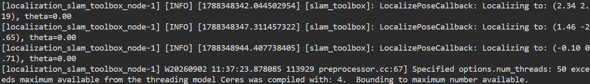

SLAM Mapping and Localization Assignment

This project implements a SLAM-based mapping and localization system using ROS 2. It includes map server setup, node lifecycle management, and visualization with RViz.

Introduction
    This project aims to deploy a SLAM system using ROS 2 for mapping and localization. It involves running multiple nodes such as the map server, robot state publisher, SLAM toolbox, and visualization tools like RViz.

System Overview
    The key nodes involved include:
    /map_server: Publishes the map.
    /robot_state_publisher: Publishes joint states and transforms.
    /slam_toolbox: Performs SLAM operations.
    /rviz: Visualization.
    /ros_gz_bridge: Bridges ROS 2 with Gazebo or Ignition Gazebo.
    Internal transform listener nodes for coordinate transformations.

Setup Instructions
    Create launch file: slam-mapping-localization-norasheikhly
        src folder
            create the package slam_toolbox_demo
                create 
                    config /slam_toolbox_online_async.yaml
                        contains the important parameters
                    launch /slam_toolbox_online_async.launch.py
                    map

      Install dependencies as specified in package.xml and CMakeLists.txt.
      Build and source

      make sure topics are running by ros2 topic list
                LiDAR ros2 topic echo /scan --once
                ros2 topic echo /odom --once
                
    Launch the slam toolbox 
    ros2 launch slam_toolbox_demo slam_toolbox_online_async.launch.py

    Open rviz2 (add displays and configurations) visualize the map and the robot with the lazer localization
    control the robot movement by keyboard to grow the map, find the free spaces, pbstacles and the borders of the map.

<video controls src="slam-key_control.mp4" title="Title"></video>

    TF Tree

    
    Save the map: will create 2 files under map
        turtlebot3_world_map.yaml / the description of the map and links the image to the navigation system 
        turtlebot3_world_map.pgm /the actual map image (black:obstacles, while: free space, grey: unknown area)

        to get the saved map:
        start the map server, to activate it run the lifecycle manager in another terminal, open arviz2 and display the saved map.

    serialize the posegraph:
        launch the pose graph to allow slam toolbox to reload the map and localize the rebot.
        under posegraph folder will have 
            turtlebot3_world.posegraph
            turtlebot3_world.data

Building teh Localization:       
    for the slam toolbox mapping mode to run we have to build the localization file slam_toolbox_localization.yaml under config
    and 
    localization.launch.py under launch

    update cmakelists.txt
    build and source

    Test the process:
    terminal1: launch the localization file
    terminal2: open rviz2
    fix the map frames and add the marker array.

Visualize the robot path (saved prev)

    selecting the 2D pose estimate for wrong positions
        image one showing the laser mismatch
        

    selecting the 2D pose estimate for correct positions 
        image one showing the laser alignment
         

    As the robot moves the odometry reads

    (this reading is accurate as the robot records moving forward, right, left, or reverse)

